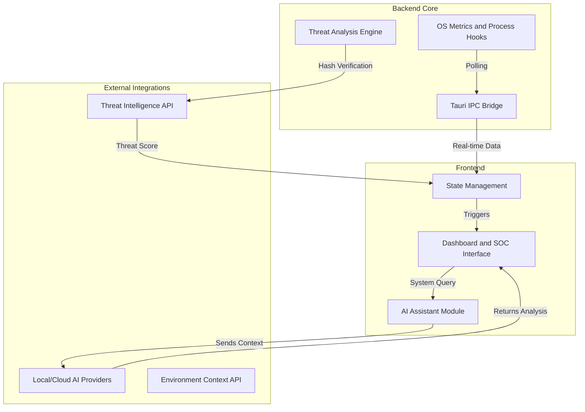

# FIKRION Autonomous Security Platform
*Developed by A. HALIDDIN — "just a nerd in his habitat"*

<!-- PASTE YOUR MAIN DASHBOARD SCREENSHOT HERE:  -->

**FIKRION** is an intelligent, AI-driven endpoint security and system monitoring platform built with Rust (Tauri), React, and Tailwind CSS. It acts as an autonomous Security Operations Center (SOC), combining system-level telemetry, real-time threat intelligence, and advanced AI reasoning to monitor, investigate, and protect endpoints.

## Core Features

<!-- Copy and paste this block for each feature you want to highlight -->
### 1. [Feature Name]
<!-- PASTE YOUR FEATURE SCREENSHOT HERE:  -->
*Describe the feature here. What does it do? How does it help the user?*

### 2. [Feature Name]
<!-- PASTE YOUR FEATURE SCREENSHOT HERE:  -->
*Describe the feature here. What does it do? How does it help the user?*

### 3. [Feature Name]
<!-- PASTE YOUR FEATURE SCREENSHOT HERE:  -->
*Describe the feature here. What does it do? How does it help the user?*

## Architecture and Flow Diagram

FIKRION operates through a decoupled architecture where the lightweight Rust backend handles low-level operating system operations, and the React frontend provides a responsive command center.



## Configuring the Intelligence Engine

FIKRION utilizes a plug-and-play AI system that supports entirely local offline processing alongside powerful cloud models.

### 1. Initial Setup
Upon initial deployment, you will be greeted by the Setup Wizard. To properly configure the platform:
1. Navigate to the **Settings** module.
2. Enter your API keys and configuration parameters. These are stored locally and securely via encrypted persistence and are never pushed to source control.

### 2. Supported Inference Providers
Administrators can seamlessly switch between AI providers based on privacy requirements and hardware capabilities:
* **Ollama (Local and Private):** Requires Ollama installed on the host machine. FIKRION will auto-detect running models for entirely offline telemetry analysis.
* **Groq:** Ultra-fast cloud inference designed for real-time analysis.
* **OpenAI:** Industry-standard models for complex reasoning.
* **Model Context Protocol (MCP):** Enterprise integration for localized tooling.

### 3. Utilizing the Autonomous SOC
Once an AI provider is configured:
* Navigate to the **AI Assistant** or **AI SOC** tabs.
* You can issue direct commands or ask the engine to analyze your active threat queue.
* The AI dynamically ingests the endpoint's real-time state, environmental context, and current threat queue before generating a response or mitigation strategy.

## Security and Privacy Guidelines

All sensitive configurations, API keys, and manual location inputs are securely managed within the local client state. 

**Important:** Do not hardcode API keys into the source files or environment variables tracked by version control. FIKRION is strictly designed to ingest credentials purely through its UI runtime settings to prevent accidental credential leakage.

## Development and Deployment

To run FIKRION locally in a development environment:

```bash
# Install dependencies
npm install

# Start the Tauri development window
npm run tauri dev
```

To compile and build for production deployment:

```bash
npm run tauri build
```

## The Meaning of FIKRION

Most security products are named after physical barriers: Sentinel, Shield, Guard, Fortress, Armor. FIKRION is different. It is named after a cognitive process — *thinking* — which positions it as an engine that understands threats rather than just blocks them.

* **FIKR** comes from Arabic, written as فكر, meaning Thought, Thinking, or Intelligence. It is a classical Arabic root used across philosophy, theology, and literature to describe deep deliberate reasoning — not just thinking, but analytical contemplation.
* **ION** comes from Greek and modern physics. An ion is a charged particle — an atom or molecule that carries energy and moves with purpose and direction. In technology branding, the ION suffix also suggests momentum, signal, and transmission.

**Combined Meaning:** *A Thought That Moves With Purpose*, or more formally: *An Intelligent Thinking Engine* — a mind that not only reasons but acts on what it discovers.

**Tagline Alignment:** *Think Before the Threat* — directly reflects the FIKR root. FIKRION does not react. It thinks first.

*(Pronunciation: FIK-ree-ON)*
